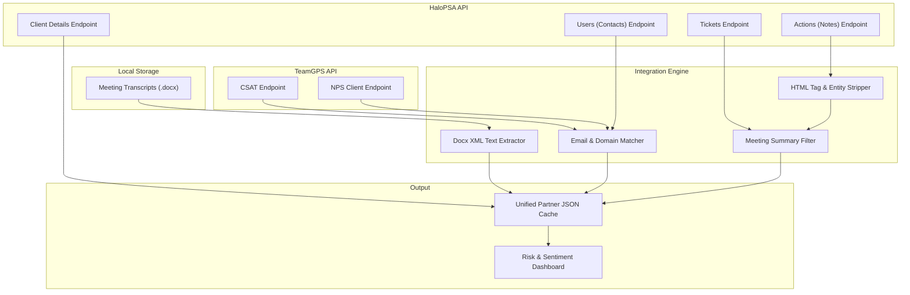

# SOP: Data Extraction & Integration Pattern for PartnerPulse Dashboard

This document details the standardized multi-source data extraction, cleaning, and integration pattern that was successfully established for Logically (Client ID: 106). This procedure should be implemented programmatically for all other partners to populate the unified sentiment and risk analysis dashboard.

---

## Data Integration Architecture



---

## 1. Local Meeting Transcripts

Meeting transcripts provide qualitative, raw conversational context. They are stored as Word documents (`.docx`).

### Directory Structure
```
C:/Temp/PartnerPulse/Transcripts/{PartnerName}/
```
*Example*: `C:/Temp/PartnerPulse/Transcripts/Logically/Logically  _ ITBD Service Call (1).docx`

### Extraction & Parsing Logic

There are two recommended approaches to parse the Word transcripts:

#### Option A: Microsoft MarkItDown (Recommended)
Microsoft's [MarkItDown](https://github.com/microsoft/markitdown) is an open-source Python utility designed to convert Word (.docx), PDF, Excel, and other file types directly into formatted Markdown. This is highly useful for feeding clean document structures (including tables and lists) directly to LLMs.

**Installation**:
```bash
pip install markitdown
```

**Usage**:
```python
from markitdown import MarkItDown

def extract_docx_markdown(docx_path):
    md = MarkItDown()
    result = md.convert(docx_path)
    return result.text_content
```

#### Option B: Zero-Dependency Custom Parser (Fallback)
If external packages are restricted or unavailable, `.docx` files can be treated as standard zip archives and parsed using Python's standard library (`zipfile` and `xml.etree.ElementTree`):

```python
import zipfile
import xml.etree.ElementTree as ET

def extract_docx_text(docx_path):
    ns = {'w': 'http://schemas.openxmlformats.org/wordprocessingml/2006/main'}
    with zipfile.ZipFile(docx_path) as docx:
        tree = ET.parse(docx.open('word/document.xml'))
        root = tree.getroot()
        
        paragraphs = []
        for p in root.findall('.//w:p', ns):
            p_text = []
            for t in p.findall('.//w:t', ns):
                if t.text:
                    p_text.append(t.text)
            if p_text:
                paragraphs.append("".join(p_text))
        return "\n".join(paragraphs)
```

### Transcript Information Schema
The first 3-5 lines of the parsed text contain metadata that should be extracted:
* **Line 1 (Title)**: `Logically   ITBD Service Call-20260403_145929UTC-Meeting Recording` (regex matches: `{PartnerName} ... Service Call-{Date}_{Time}`)
* **Line 2 (Date)**: `April 3, 2026, 2:59PM`
* **Line 3 (Duration)**: `19m 37s`
* **Dialogue Speakers**: Regex match `^([A-Z][a-zA-Z'\-\s]+)\s+\d+:\d+` (e.g. `Akhilesh Shukla   0:27`) to compile a speaker list and map user utterances.

---

## 2. Customer Satisfaction (CSAT) — TeamGPS

CSAT reviews provide ticket-level feedback from end users on completed service requests.

* **Base URL**: `https://api.team-gps.net/open-api/v1`
* **Endpoint**: `GET /csat/`
* **Headers**: `X-API-KEY: {api_key}`
* **Query Parameters**:
  * `company`: `{exact_match_client_name}` (e.g. `Logically`)
  * `page_size`: `1000`
  * `page`: `1` (increment if paginating)

### Response Schema (CSAT List)
> [!WARNING]
> **Schema Quirk**: The CSAT endpoint wraps its results list in `data.results`.

```json
{
  "message": "CSAT reviews fetched successfully.",
  "data": {
    "current": 1,
    "total": 509,
    "total_pages": 1,
    "results": [
      {
        "id": 877283,
        "rating": "Positive",       // Or "Neutral", "Negative"
        "comment": "He did a great job resolving this issue.",
        "company": "Logically",
        "contact_name": "Tim Ramos",
        "contact_email": "tim.ramos@logically.com",
        "submitted_date": "2026-04-23T20:05:26.752444Z",
        "ticket_id": "720701",
        "ticket_name": "Monthly Feedback for Renz Santos"
      }
    ]
  }
}
```

---

## 3. Net Promoter Score (NPS) — TeamGPS

NPS client surveys capture high-level strategic satisfaction.

* **Base URL**: `https://api.team-gps.net/open-api/v1`
* **Endpoint**: `GET /survey/nps-client/`
* **Headers**: `X-API-KEY: {api_key}`
* **Query Parameters**:
  * `page_size`: `1000`
  * `page`: `1` (NPS endpoint must be fully retrieved and filtered locally, as there is no server-side company/client filter)

### Response Schema (NPS List)
> [!WARNING]
> **Schema Quirk**: Unlike CSAT, the NPS endpoint wraps its results list in `data.data`.

```json
{
  "message": "NPS Client responses fetched successfully.",
  "data": {
    "pagination": {
      "page": 1,
      "page_size": 1000,
      "total_count": 1759,
      "total_pages": 2
    },
    "data": [
      {
        "id": 963345,
        "nps_score": 9,
        "nps_category": "Promoter", // Or "Passive", "Detractor"
        "comment": "ITBD is a great partner.",
        "respondent_email": "jmcguigan@logically.com",
        "submitted_date": "2026-06-03T12:28:55.855280Z"
      }
    ]
  }
}
```

### Locally Filtering NPS by Partner
Since the API returns all client NPS reviews, filter the results in the integration code:
1. Fetch all user records for the client from HaloPSA (see Section 4).
2. Collect the set of exact `emailaddress` values and the set of email domain names (e.g. `{'logically.com', 'obviam.com'}`).
3. Filter NPS records where `respondent_email` matches a client contact email or the domain matches.

---

## 4. Client Metadata & Users — HaloPSA

Client-level fields and contact lists must be pulled from HaloPSA to establish RAG statuses, account managers, and domains.

* **Base URL**: `https://itbd.halopsa.com/api`
* **Headers**: `Authorization: Bearer {token}` (Cached OAuth2 client credentials token)

### A. Client Details
* **Endpoint**: `GET /api/Client/{client_id}?includedetails=true`
* **Key Fields to Extract**:
  * `inactive` (bool): Filter out deactivated accounts.
  * `is_vip` (bool): Alert for VIP accounts.
  * Custom fields in the `customfields[]` array:
    * `CFCancelationRisk`: 1 (High) / 2 (Medium) / 3 (Low)
    * `CFMDERAG`: RAG status (1=Red, 2=Amber, 3=Green)
    * `CFHealthReason`: Explains RAG status downgrades (e.g., "Engineer performance")
    * `CFNextStep`: Explains remediation plans (e.g., "Mazid's SIP - 2 weeks monitoring")
    * `CFSIPTicketMDE`: Ticket ID of the active SIP

### B. Client Users (Contacts)
* **Endpoint**: `GET /api/Users?client_id={client_id}&page_size=1000&pageinate=true&includeinactive=true`
* **Extraction**: Collect all `emailaddress` strings to compile user lists and domain sets for TeamGPS NPS filtering.

---

## 5. Ticket notes & Action Items — HaloPSA

Official review meeting notes, summaries, and action items are captured in the notes section of the bi-weekly review tickets.

* **Base URL**: `https://itbd.halopsa.com/api`
* **Headers**: `Authorization: Bearer {token}`

### A. Step 1: Find Service Review Tickets
* **Endpoint**: `GET /api/Tickets?client_id={client_id}&search=Bi-Weekly Service call&page_size=5&pageinate=true`
* **Usage**: Retrieve the list of recent service call tickets. (Capped to `page_size=5` for performance).

### B. Step 2: Fetch Actions for Each Ticket
* **Endpoint**: `GET /api/Actions?ticket_id={ticket_id}`
* **Response**: A bare JSON list of actions containing `id`, `who`, `datetime`, and a brief note.

### C. Step 3: Fetch Action Details & Clean Content
Because list summaries are truncated, query the detail endpoint for every action in the ticket:
* **Endpoint**: `GET /api/Actions/{action_id}?ticket_id={ticket_id}`

#### HTML Cleaning Logic
The `note` returned is HTML. Clean it using Python standard regex:
```python
import re

def clean_html(raw_html):
    if not raw_html:
        return ""
    cleanr = re.compile('<.*?>')
    cleantext = re.sub(cleanr, '', raw_html)
    cleantext = cleantext.replace('&nbsp;', ' ').replace('&lt;', '<').replace('&gt;', '>')
    return cleantext.strip()
```

#### Meeting Notes Identifier
Filter the cleaned action notes for key markers: `"meeting summary"`, `"action items"`, `"discussion points"`, or `"join the call"`. This isolates the actual meeting write-up from automated system logs (such as status changes or email auto-responses).

---

## 6. Execution Workflow for a Partner Run

To scan a new partner in the system, the dashboard engine must execute these steps sequentially:

```
[Start]
  │
  ├─► 1. Get HaloPSA token via OAuth client_credentials flow.
  │
  ├─► 2. Query Client details (GET Client/{id}) & verify custom fields (RAG, Risk).
  │
  ├─► 3. Query Client Users list & construct set of emails and domain extensions.
  │
  ├─► 4. Fetch all CSAT reviews filtered by company name matching client.
  │
  ├─► 5. Fetch NPS client reviews & filter locally using the user email/domain sets.
  │
  ├─► 6. Search for the 5 most recent 'Bi-Weekly Service call' tickets for the client.
  │
  ├─► 7. For each ticket:
  │      ├─ Fetch actions list.
  │      └─ Fetch action details, clean HTML, and extract meeting summaries & action items.
  │
  ├─► 8. Parse the local directory for Word transcripts matching the client's name.
  │
  ├─► 9. Merge and cache all extracted data into a unified Partner JSON payload.
  │
  └─► [End: Render Dashboard UI]
```
